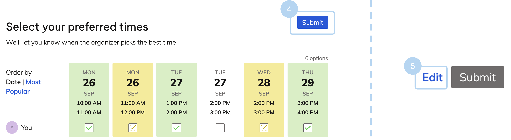

# doodle
Simple doodle poll implementation for user testing: [https://catherinesyeh.github.io/doodle/](https://catherinesyeh.github.io/doodle/)

## instructions
Open [webpage](https://catherinesyeh.github.io/doodle/) to start exploring. The app comes preloaded with some potential meeting times and the availabilities of three made up people.

*Try these features out!*
1. **Sort** the available times slots by date or by popularity
* This is a distinguishing feature since users don't have to option to change the view on when2meet
2. Indicate your availability by **clicking** on a time slot (1 click = yes, 2 clicks = if need be, 3 clicks = reset back to no)
* This is a distiguishing feature since users can only say yes/no to a time on when2meet; also, they click & drag over time slots to indicate their availability
* _Note:_ on the real doodle, users can click anywhere on the time slot to indicate their availability (not just within the checkbox), so I implemented it that way here too
3. **See the availability** of the other participants and the **total count** of who's available at the top of each column
* This is a distinguishing feature since when to meet has a more heat map view of who's available at any given time
* Additionally, it's not easy to see all the times when a particular participant is available in when2meet -- you can only see who's available at a given time by hovering over the slot

4. Once you click at least one time slot, you can **submit** your times by pressing the "submit" button
* This is a distinguishing feature because on when2meet, there's no explicit submit option -- as you input your availability, it's automatically reflected on the group heat map
5. After submitting, users can also **edit** their submitted availability
* Both platforms have editing capability, but on when2meet, it's more implicit, as there's no submit, and on doodle, you have to explicitly press a button to update your response & then resubmit
* _Note:_ this is probably not as important of a distinguishing feature

## other notes
This UI was implemented from scratch, without using other resources. I focused on the inputting availability aspects of both platforms, so I didn't incorporate differences in login, calendar syncing, etc.
